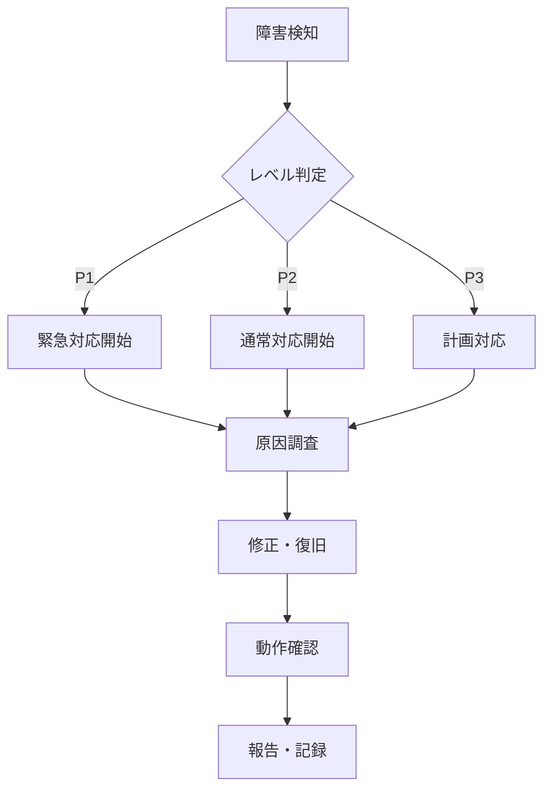

# HelloChicago デプロイメント設計書
test
## 概要

HelloChicagoアプリケーションのデプロイメント設計書です。開発から本番運用まで、安全で効率的なデプロイメントプロセスを確立しています。

## 📚 この文書の役割と関連

- 本書: 環境構成、CI/CD、監視、運用手順
- テスト計画や網羅性は [テスト戦略書](./test-strategy.md) を参照
- 技術的なAPIやスキーマは [技術仕様書](./technical-specification.md) を参照
- ビジネス要件は [PRD](./prd.md) を参照

## アーキテクチャ概要

### 技術スタック

- **フロントエンド**: React + TypeScript + Vite
- **バックエンド**: Supabase (PostgreSQL + Auth + Storage)
- **地図API**: Mapbox
- **デプロイ**: Netlify (フロントエンド)
- **CDN**: Cloudflare
- **監視**: Sentry + Supabase Analytics

### インフラ構成図

```
┌─────────────────┐    ┌─────────────────┐    ┌─────────────────┐
│   Frontend      │    │   Backend       │    │   External      │
│   (Netlify)     │◄──►│   (Supabase)    │◄──►│   Services      │
│                 │    │                 │    │                 │
│ • React App     │    │ • PostgreSQL    │    │ • Mapbox API    │
│ • Static Files  │    │ • Auth Service  │    │ • Email Service │
│ • CDN Cache     │    │ • Storage       │    │ • Analytics     │
└─────────────────┘    └─────────────────┘    └─────────────────┘
```

## 環境構成

### 環境一覧

| 環境            | URL                                | 用途       | データベース        |
| --------------- | ---------------------------------- | ---------- | ------------------- |
| **Development** | `http://localhost:3000`            | 開発環境   | Supabase Dev        |
| **Staging**     | `https://staging.hellochicago.app` | テスト環境 | Supabase Staging    |
| **Production**  | `https://hellochicago.app`         | 本番環境   | Supabase Production |

### 環境変数管理

#### 開発環境 (.env.local)

```bash
# Supabase
VITE_SUPABASE_URL=https://your-project.supabase.co
VITE_SUPABASE_ANON_KEY=your-anon-key

# Mapbox
VITE_MAPBOX_ACCESS_TOKEN=your-mapbox-token

# Analytics
VITE_SENTRY_DSN=your-sentry-dsn
```

#### ステージング環境 (Netlify)

```bash
# Supabase
VITE_SUPABASE_URL=https://staging-project.supabase.co
VITE_SUPABASE_ANON_KEY=staging-anon-key

# Mapbox
VITE_MAPBOX_ACCESS_TOKEN=staging-mapbox-token

# Analytics
VITE_SENTRY_DSN=staging-sentry-dsn
```

#### 本番環境 (Netlify)

```bash
# Supabase
VITE_SUPABASE_URL=https://production-project.supabase.co
VITE_SUPABASE_ANON_KEY=production-anon-key

# Mapbox
VITE_MAPBOX_ACCESS_TOKEN=production-mapbox-token

# Analytics
VITE_SENTRY_DSN=production-sentry-dsn
```

## CI/CDパイプライン

### GitHub Actions ワークフロー

#### 1. 開発環境デプロイ

```yaml
# .github/workflows/develop.yml
name: Deploy to Development

on:
  push:
    branches: [develop]

jobs:
  test:
    runs-on: ubuntu-latest
    steps:
      - uses: actions/checkout@v3
      - uses: actions/setup-node@v3
        with:
          node-version: '18'
      - run: npm ci
      - run: npm run test
      - run: npm run build

  deploy:
    needs: test
    runs-on: ubuntu-latest
    steps:
      - uses: actions/checkout@v3
      - uses: actions/setup-node@v3
        with:
          node-version: '18'
      - run: npm ci
      - run: npm run build
      - uses: netlify/actions/cli@master
        with:
          args: deploy --dir=dist --prod=false
        env:
          NETLIFY_AUTH_TOKEN: ${{ secrets.NETLIFY_AUTH_TOKEN }}
          NETLIFY_SITE_ID: ${{ secrets.NETLIFY_SITE_ID_DEV }}
```

#### 2. ステージング環境デプロイ

```yaml
# .github/workflows/staging.yml
name: Deploy to Staging

on:
  push:
    branches: [staging]

jobs:
  test:
    runs-on: ubuntu-latest
    steps:
      - uses: actions/checkout@v3
      - uses: actions/setup-node@v3
        with:
          node-version: '18'
      - run: npm ci
      - run: npm run test:unit
      - run: npm run test:integration
      - run: npm run build

  deploy:
    needs: test
    runs-on: ubuntu-latest
    steps:
      - uses: actions/checkout@v3
      - uses: actions/setup-node@v3
        with:
          node-version: '18'
      - run: npm ci
      - run: npm run build
      - uses: netlify/actions/cli@master
        with:
          args: deploy --dir=dist --prod=false
        env:
          NETLIFY_AUTH_TOKEN: ${{ secrets.NETLIFY_AUTH_TOKEN }}
          NETLIFY_SITE_ID: ${{ secrets.NETLIFY_SITE_ID_STAGING }}
```

#### 3. 本番環境デプロイ

```yaml
# .github/workflows/production.yml
name: Deploy to Production

on:
  push:
    tags: ['v*']

jobs:
  test:
    runs-on: ubuntu-latest
    steps:
      - uses: actions/checkout@v3
      - uses: actions/setup-node@v3
        with:
          node-version: '18'
      - run: npm ci
      - run: npm run test:unit
      - run: npm run test:integration
      - run: npm run test:e2e
      - run: npm run test:security
      - run: npm run build

  deploy:
    needs: test
    runs-on: ubuntu-latest
    steps:
      - uses: actions/checkout@v3
      - uses: actions/setup-node@v3
        with:
          node-version: '18'
      - run: npm ci
      - run: npm run build
      - uses: netlify/actions/cli@master
        with:
          args: deploy --dir=dist --prod=true
        env:
          NETLIFY_AUTH_TOKEN: ${{ secrets.NETLIFY_AUTH_TOKEN }}
          NETLIFY_SITE_ID: ${{ secrets.NETLIFY_SITE_ID_PROD }}
```

### デプロイメント戦略

#### Blue-Green Deployment

```yaml
# 本番デプロイ時の戦略
deployment_strategy:
  type: blue-green
  health_check:
    path: /health
    timeout: 30s
    interval: 10s
  rollback:
    automatic: true
    threshold: 5%_error_rate
```

#### カナリアリリース

```yaml
# 段階的リリース
canary_release:
  initial_traffic: 10%
  duration: 1h
  success_criteria:
    - error_rate < 1%
    - response_time < 2s
  auto_promote: true
```

## ビルド設定

### Vite設定

```typescript
// vite.config.ts
import { defineConfig } from 'vite';
import react from '@vitejs/plugin-react';

export default defineConfig({
  plugins: [react()],
  build: {
    outDir: 'dist',
    sourcemap: true,
    rollupOptions: {
      output: {
        manualChunks: {
          vendor: ['react', 'react-dom'],
          supabase: ['@supabase/supabase-js'],
          mapbox: ['mapbox-gl'],
        },
      },
    },
  },
  define: {
    __SENTRY_RELEASE__: JSON.stringify(process.env.npm_package_version),
  },
});
```

### Netlify設定

```toml
# netlify.toml
[build]
  command = "npm run build"
  publish = "dist"

[build.environment]
  NODE_VERSION = "18"

[[redirects]]
  from = "/*"
  to = "/index.html"
  status = 200

[[headers]]
  for = "/*"
  [headers.values]
    X-Frame-Options = "DENY"
    X-XSS-Protection = "1; mode=block"
    X-Content-Type-Options = "nosniff"
    Referrer-Policy = "strict-origin-when-cross-origin"

[[headers]]
  for = "/assets/*"
  [headers.values]
    Cache-Control = "public, max-age=31536000, immutable"
```

## データベース管理

### マイグレーション戦略

#### 開発環境

```bash
# ローカル開発時
supabase db reset
supabase db push
```

#### ステージング環境

```bash
# ステージングデプロイ時
supabase db push --db-url $STAGING_DB_URL
```

#### 本番環境

```bash
# 本番デプロイ時（手動実行）
supabase db push --db-url $PRODUCTION_DB_URL
```

### バックアップ戦略

#### 自動バックアップ

```sql
-- Supabase自動バックアップ設定
-- 日次バックアップ（保持期間: 30日）
-- ポイントインタイムリカバリ（保持期間: 7日）
```

#### 手動バックアップ

```bash
# データベースエクスポート
pg_dump $DATABASE_URL > backup_$(date +%Y%m%d).sql

# 特定テーブルのエクスポート
pg_dump -t posts -t profiles $DATABASE_URL > posts_backup.sql
```

## 監視・ログ

### アプリケーション監視

#### Sentry設定

```typescript
// src/lib/sentry.ts
import * as Sentry from '@sentry/react';

Sentry.init({
  dsn: import.meta.env.VITE_SENTRY_DSN,
  environment: import.meta.env.NODE_ENV,
  release: import.meta.env.__SENTRY_RELEASE__,
  integrations: [new Sentry.BrowserTracing(), new Sentry.Replay()],
  tracesSampleRate: 0.1,
  replaysSessionSampleRate: 0.1,
  replaysOnErrorSampleRate: 1.0,
});
```

#### パフォーマンス監視

```typescript
// カスタムパフォーマンス監視
const performanceObserver = new PerformanceObserver(list => {
  for (const entry of list.getEntries()) {
    if (entry.entryType === 'navigation') {
      Sentry.metrics.timing(
        'page.load',
        entry.loadEventEnd - entry.loadEventStart
      );
    }
  }
});

performanceObserver.observe({ entryTypes: ['navigation'] });
```

### ログ管理

#### フロントエンドログ

```typescript
// src/lib/logger.ts
export const logger = {
  info: (message: string, data?: any) => {
    console.log(`[INFO] ${message}`, data);
    Sentry.addBreadcrumb({
      category: 'info',
      message,
      data,
    });
  },
  error: (message: string, error?: Error) => {
    console.error(`[ERROR] ${message}`, error);
    Sentry.captureException(error);
  },
  warn: (message: string, data?: any) => {
    console.warn(`[WARN] ${message}`, data);
    Sentry.addBreadcrumb({
      category: 'warning',
      message,
      data,
    });
  },
};
```

#### バックエンドログ（Supabase）

```sql
-- ログテーブルの作成
CREATE TABLE IF NOT EXISTS app_logs (
  id uuid PRIMARY KEY DEFAULT gen_random_uuid(),
  level text NOT NULL,
  message text NOT NULL,
  user_id uuid REFERENCES profiles(id),
  metadata jsonb,
  created_at timestamptz DEFAULT now()
);

-- ログ挿入関数
CREATE OR REPLACE FUNCTION log_app_event(
  p_level text,
  p_message text,
  p_user_id uuid DEFAULT NULL,
  p_metadata jsonb DEFAULT NULL
) RETURNS void AS $$
BEGIN
  INSERT INTO app_logs (level, message, user_id, metadata)
  VALUES (p_level, p_message, p_user_id, p_metadata);
END;
$$ LANGUAGE plpgsql;
```

## セキュリティ

### セキュリティヘッダー

```typescript
// セキュリティヘッダー設定
const securityHeaders = {
  'Content-Security-Policy': [
    "default-src 'self'",
    "script-src 'self' 'unsafe-inline' 'unsafe-eval' https://api.mapbox.com",
    "style-src 'self' 'unsafe-inline' https://api.mapbox.com",
    "img-src 'self' data: https: blob:",
    "connect-src 'self' https://*.supabase.co https://api.mapbox.com",
    "frame-ancestors 'none'",
  ].join('; '),
  'Strict-Transport-Security': 'max-age=31536000; includeSubDomains',
  'X-Content-Type-Options': 'nosniff',
  'X-Frame-Options': 'DENY',
  'X-XSS-Protection': '1; mode=block',
  'Referrer-Policy': 'strict-origin-when-cross-origin',
};
```

### 環境変数セキュリティ

```bash
# 機密情報の管理
# .env.local（開発環境のみ）
VITE_SUPABASE_URL=https://your-project.supabase.co
VITE_SUPABASE_ANON_KEY=your-anon-key

# 本番環境はNetlify環境変数で管理
# GitHub Secretsで管理
NETLIFY_AUTH_TOKEN=your-netlify-token
NETLIFY_SITE_ID=your-site-id
```

## パフォーマンス最適化

### フロントエンド最適化

#### コード分割

```typescript
// 動的インポート
const MapView = lazy(() => import('./components/MapView'));
const PostFormView = lazy(() => import('./components/PostFormView'));
```

#### 画像最適化

```typescript
// 画像の遅延読み込み
 {
    e.currentTarget.src = '/placeholder.jpg';
  }}
/>
```

#### キャッシュ戦略

```typescript
// Service Worker設定
// public/sw.js
const CACHE_NAME = 'hellochicago-v1';
const urlsToCache = ['/', '/static/js/bundle.js', '/static/css/main.css'];

self.addEventListener('install', event => {
  event.waitUntil(
    caches.open(CACHE_NAME).then(cache => cache.addAll(urlsToCache))
  );
});
```

### CDN設定

#### Cloudflare設定

```yaml
# cloudflare.toml
[env.production]
  cache_everything = true
  cache_by_device_type = true
  minify = { css = true, html = true, js = true }
  rocket_loader = true
  always_online = true
```

## 障害対応

### 障害レベル定義

| レベル | 影響範囲       | 対応時間   | 対応者         |
| ------ | -------------- | ---------- | -------------- |
| **P1** | 全ユーザー影響 | 1時間以内  | 開発チーム全員 |
| **P2** | 一部機能影響   | 4時間以内  | 担当開発者     |
| **P3** | 軽微な影響     | 24時間以内 | 担当開発者     |

### 障害対応フロー



### ロールバック手順

```bash
# 緊急ロールバック
git checkout HEAD~1
npm run build
netlify deploy --prod --dir=dist

# データベースロールバック
supabase db reset --db-url $PRODUCTION_DB_URL
```

## 運用監視

### 監視ダッシュボード

#### 主要メトリクス

- **可用性**: 99.9%以上
- **応答時間**: 2秒以内
- **エラー率**: 1%以下
- **ユーザー数**: アクティブユーザー数

#### アラート設定

```yaml
# アラート条件
alerts:
  - name: 'High Error Rate'
    condition: 'error_rate > 5%'
    duration: '5m'
    notification: ['slack', 'email']

  - name: 'Slow Response Time'
    condition: 'response_time > 3s'
    duration: '2m'
    notification: ['slack']

  - name: 'Service Down'
    condition: 'availability < 95%'
    duration: '1m'
    notification: ['slack', 'phone']
```

### 定期メンテナンス

#### 週次メンテナンス

- [ ] ログファイルの確認
- [ ] パフォーマンスメトリクスの確認
- [ ] セキュリティログの確認
- [ ] バックアップの確認

#### 月次メンテナンス

- [ ] 依存関係の更新
- [ ] セキュリティパッチの適用
- [ ] データベースの最適化
- [ ] 監視設定の見直し

## コンプライアンス

### データ保護

#### GDPR対応

```typescript
// データ削除機能
const deleteUserData = async (userId: string) => {
  // ユーザーデータの完全削除
  await supabase.from('posts').delete().eq('author_id', userId);
  await supabase.from('profiles').delete().eq('id', userId);
  await supabase.auth.admin.deleteUser(userId);
};
```

#### プライバシーポリシー

- 個人情報の収集・利用目的の明示
- データの保持期間の明示
- ユーザーの権利（削除・訂正等）の明示

### アクセシビリティ

#### WCAG 2.1 AA準拠

```typescript
// アクセシビリティ対応
const accessibleButton = (
  <button
    aria-label="投稿を作成"
    aria-describedby="post-description"
    onClick={handleClick}
  >
    投稿する
  </button>
);
```

## 将来の拡張

### スケーラビリティ計画

#### 短期的拡張（3ヶ月）

- [ ] マイクロサービス化の検討
- [ ] キャッシュレイヤーの追加
- [ ] 負荷分散の実装

#### 中期的拡張（6ヶ月）

- [ ] マルチリージョンデプロイ
- [ ] 自動スケーリングの実装
- [ ] 災害復旧計画の策定

#### 長期的拡張（1年）

- [ ] コンテナ化（Docker/Kubernetes）
- [ ] サーバーレスアーキテクチャの検討
- [ ] エッジコンピューティングの活用

## 最新のデプロイメント状況

### Phase 2 完了済みデプロイ ✅

- ✅ **プロフィール詳細機能**: profile_details テーブル
- ✅ **通知システム**: notifications, notification_settings テーブル
- ✅ **画像アップロード**: Supabase Storage統合
- ✅ **設定統合機能**: 各種設定画面の統合

### プロフィール機能デプロイ完了 ✅

- ✅ **全機能完了**: プロフィール機能の完全実装
- ✅ **本番運用**: 安定稼働中

### デプロイメント監視強化

#### 新規追加された監視項目

- **通知配信率**: 通知の正常配信率監視
- **プロフィール完成度**: ユーザーの詳細情報入力率
- **画像アップロード成功率**: Storage連携の安定性
- **設定変更頻度**: ユーザーの設定利用状況

---

**最終更新**: 2025年1月
**バージョン**: 2.1
**作成者**: HelloChicago開発チーム
